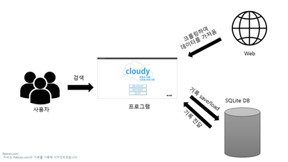
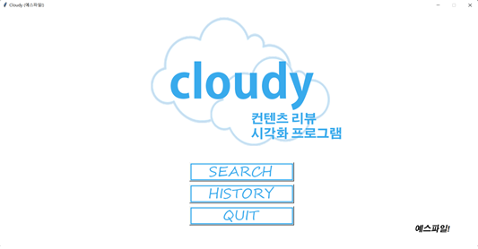

:pushpin:프로젝트명
------------
클라우디 : 문화 콘텐츠 리뷰 데이터 시각화 프로그램    
Cloudy : Cultural contents review data visualization program

:heavy_check_mark:개발 기간
-------------
2022년 5월 5일 ～ 2022년 6월 10일

:heavy_check_mark:개발 목적
-----------------
문화 컨텐츠에 대한 수요와 공급이 높아짐에 따라 많은 양의 리뷰를 시각화하여 한 눈에 알아보기 쉽게 하고 사용자가 문화 컨텐츠를 선택함에 있어 도움을 주고자 함.

:heavy_check_mark:작품의 주요 기능
----------------
1. 이용자가 검색할 키워드를 입력하고 분류를 설정한다.(영화, 드라마, 책 등)
2. 각종 리뷰 사이트에서 크롤링하여 데이터를 가져온다.
3. 리뷰 데이터에서 의미 있는 단어들의 빈도수를 체크 한다.
4. 긍정적인 단어와 부정적인 단어를 분류 분석한다.
5. 워드 클라우드를 생성한다.
6. 데이터베이스를 활용해서 검색 기록 확인 기능을 제공한다

:heavy_check_mark:팀 업무 분장
--------------

:woman:김가현     
팀장. UI 디자인, 보고서 작성, 발표 스크립트/ppt 준비, Github 관리     
:man:김동민     
팀원. Tkinter을 활용하여 프로그램 UI 구현, UI와 코드 연결     
:woman:김예경     
팀원. 영화/서점/앱 웹 사이트 리뷰 크롤링, 워드 클라우드 생성 구현     
:man:허정윤    
팀원. Sqlite을 활용하여 데이터베이스 설계 및 구현, 일부 보고서 작성       

:heavy_check_mark:시스템 구성도
------------

실행화면
-----------
홈 화면

검색 화면 

